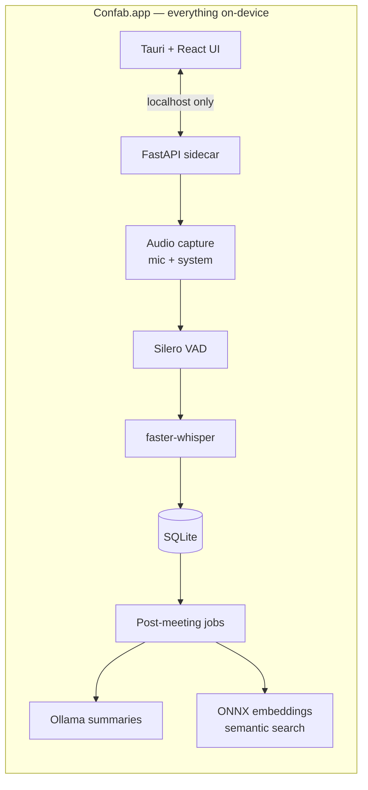

# Confab

**Private, on-device AI meeting notes for macOS.** Confab records your meetings, transcribes them live, summarizes them with a local LLM, and lets you search and chat across everything you've ever discussed — and none of it ever leaves your Mac.

No cloud. No bots joining your calls. No subscription. No audio uploaded anywhere.

> 🚧 **v0.1.0 — first public release.** Download the DMG from
> [Releases](https://github.com/hk2166/Transcriber/releases/latest).

## Features

- **Live transcription** — speech appears on screen in under ~2 s (faster-whisper running locally)
- **AI summaries** — one click after each meeting: summary, key points, action items, decisions, open questions (via [Ollama](https://ollama.com))
- **Automatic meeting titles** — meetings name themselves from their content
- **Semantic search** — find "that thing we said about the deadline" across all meetings, by meaning, in milliseconds
- **Chat with a meeting** — ask questions, get answers grounded in the transcript with citations
- **Export** — Markdown, PDF, Word, JSON
- **System audio + mic** — capture both sides of a call (system audio via BlackHole)
- **100% local** — every model runs on your Mac; the app makes zero network calls with your content

## Requirements

- macOS 13.3+ (Apple Silicon recommended)
- ~1 GB free disk for the app + Whisper model (downloaded on first use)
- Optional: [Ollama](https://ollama.com) for summaries & chat (the app works transcription-only without it)
- Optional: [BlackHole 2ch](https://existential.audio/blackhole/) to capture system audio (mic-only works out of the box)

## How it works



The UI is a Tauri 2 shell; the engine is a Python FastAPI sidecar bundled with PyInstaller, bound to `127.0.0.1` on a random free port. Live audio flows capture → voice-activity detection → Whisper → SQLite; diarization-free by design on the live path so latency stays low. Summaries, embeddings, and search indexing run as background jobs after a meeting ends.

## Development

```bash
# backend (Python 3.12, uv)
cd apps/backend && uv sync && cd ../..

# frontend
cd apps/desktop && npm install && cd ../..

# run everything (Ollama + backend on :8765 + Vite on :1420)
./launch.sh          # stop with ./kill.sh

# tests
cd apps/backend && uv run pytest -q --ignore=tests   # fast suite
cd apps/backend && uv run pytest tests/e2e -q        # full pipeline (~35 s)
```

The desktop shell runs with `npm run tauri dev` in `apps/desktop` (expects the backend on `:8765`).

## Building a release

```bash
./scripts/build-release.sh                       # unsigned DMG (local testing)
APPLE_SIGNING_IDENTITY="Developer ID Application: …" \
NOTARY_PROFILE=confab ./scripts/build-release.sh # signed + notarized
```

See [apps/backend/PACKAGING.md](apps/backend/PACKAGING.md) for the packaging design.

## Roadmap

- **v1.1** — speaker diarization in the packaged app (works in dev today; kept out of v1 to stay torch-free and lean), first-run model-download progress UI
- **Phase 2** — Windows (WASAPI loopback makes system audio easier there)

## License

TBD — all rights reserved until a license is chosen.
